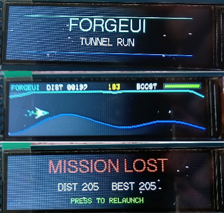

# ForgeUI Tunnel Run — ESP32-S3 + ST7789 284×76

ForgeUI Tunnel Run is a physically tested, joystick-controlled procedural tunnel game and graphics stress test for an ESP32-S3 and an ultra-wide 2.25-inch ST7789 76×284 IPS TFT. It runs in a 284×76 landscape viewport.

## Physical game pass

The hero image is physical evidence of the complete game lifecycle on the target hardware: the ForgeUI Tunnel Run title screen, active tunnel gameplay, and the `MISSION LOST` screen with distance and best distance.

## Gameplay lifecycle

Press the joystick to launch. Steer the ship through the scrolling procedural tunnel, use the joystick button to boost, and survive as speed increases and the tunnel narrows. A tunnel impact triggers `CRITICAL IMPACT`, followed by `MISSION LOST`; press the joystick again to relaunch.

## Controls

| Input | Action |
|---|---|
| Joystick X/Y | Steer the ship |
| Joystick press | Launch, boost while flying, or relaunch after `MISSION LOST` |

## Physical joystick proof

The analog joystick was independently validated on the physical hardware before Tunnel Run integration: X movement, Y movement, push switch, and display stability passed.

### Final physically proven joystick mapping

| Joystick | ESP32-S3 |
|---|---:|
| SW | GPIO4 |
| VRy | GPIO5 |
| VRx | GPIO6 |
| +5V-labelled supply | 3.3V |
| GND | GND |

The module's **+5V-labelled supply pin is intentionally powered from the ESP32-S3 3.3V rail**. GPIO7 remains spare.

## Tunnel Run graphical and technical features

- ForgeUI Tunnel Run title screen and joystick launch
- Automatic joystick centre calibration and dead zone
- X/Y ship control
- Full-screen 16-bit `TFT_eSprite` framebuffer
- Approximately 30 FPS target loop
- Multi-layer moving starfield, including boosted star streaks
- Procedural tunnel generation and animated tunnel boundaries
- Progressive tunnel narrowing, difficulty, and speed increase
- Joystick-button boost and boost recharge meter
- Exhaust particles
- Tunnel collision detection, explosion particles, and impact screen shake
- Distance scoring and best distance
- `CRITICAL IMPACT` and `MISSION LOST` states, with press-to-relaunch flow

## Hardware

### MCU

- ESP32-S3 DevKitC-1
- ESP32-S3 silicon revision v0.2
- 8 MB embedded PSRAM physically detected

### Display

- Controller: ST7789
- 2.25-inch IPS TFT
- Native resolution: 76×284
- Game viewport: 284×76 landscape
- SPI at 27 MHz

## Display and joystick wiring

### Physically proven display wiring

| TFT display | ESP32-S3 | Function |
|---|---:|---|
| GND | GND | Ground |
| VCC | 3.3V | Display power |
| SCL / SCLK | GPIO12 | SPI clock |
| SDA / MOSI | GPIO11 | SPI data |
| RST | GPIO10 | Reset |
| DC | GPIO9 | Data / command |
| CS | GPIO8 | Chip select |
| BL | GND | Active-low backlight enable |
| MISO | Unused | — |

The tested display module has an active-low backlight input, so BL is connected to GND. Other ST7789 modules may use different backlight circuitry. The joystick wiring is listed in the [final physically proven joystick mapping](#final-physically-proven-joystick-mapping).

## Proven display configuration

| Setting | Proven value |
|---|---|
| Driver | ST7789 |
| Native geometry | 76×284 |
| Landscape viewport | 284×76 |
| Rotation | 1 |
| Display inversion | `false` |
| SPI frequency | 27 MHz |
| MOSI / SCLK | GPIO11 / GPIO12 |
| CS / DC / RST | GPIO8 / GPIO9 / GPIO10 |
| Backlight | Active-low, connected to GND |

### Supporting ST7789 bring-up proof

This original physical display bring-up result validates the wiring, orientation, and ST7789 configuration used by Tunnel Run. For the standalone baseline, see the hardware-reference project below.

## Software and build information

This project uses PlatformIO with the Arduino framework for ESP32. The physically proven board, display, and library configuration is in `platformio.ini`; the Tunnel Run implementation is in `src/main.cpp`.

## Related ForgeUI wide-display projects

- [ST7789 284×76 hardware reference](https://github.com/RTechAI/forgeui-hw-st7789-284x76-wide)
- [MicroDash graphical showcase](https://github.com/RTechAI/forgeui-hw-st7789-284x76-wide-microdash)
- [MicroRacer game](https://github.com/RTechAI/forgeui-hw-st7789-284x76-wide-microracer)

## ForgeUI Hardware Lab and Studio

Tunnel Run is part of the ForgeUI Hardware Lab: practical, physically tested ESP32 projects documenting real display and input integrations. Explore [ForgeUI](https://forgeui.co.nz) and the hosted [ForgeUI Studio](https://studio.forgeui.co.nz).

## Third-party dependency attribution

This project depends on [TFT_eSPI-ST7789-76x284](https://github.com/atoomnetmarc/TFT_eSPI-ST7789-76x284.git), maintained by atoomnetmarc. It is external third-party software providing support for this ST7789 panel geometry. ForgeUI does not claim ownership of that library or fork; it retains its own copyright and licence terms.

## License and repository scope

Unless otherwise noted, ForgeUI-authored source and documentation in this repository are available under the [MIT License](LICENSE). Third-party dependencies and reference implementations remain subject to their respective licences and copyright.
